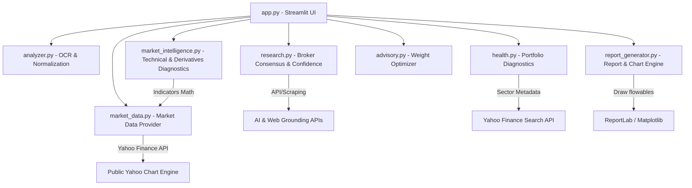

# Project State - AI Portfolio Analyzer v1.0 (Production Release)

This document provides a technical overview of the system architecture, directory layouts, data flows, and development roadmap for the final Version 1.0 release.

---

## 🏗️ System Architecture

The AI Portfolio Analyzer is built as a highly modular, decoupled application separating visual rendering, OCR extraction, web research grounding, market data fetching, quantitative market intelligence, portfolio health diagnostics, target-weight optimization, and PDF report compilation.



---

## 📁 Folder Structure

```
portfolio-analyzer/
├── data/
│   └── historical/           # Incremental market database cache (.csv)
├── outputs/                  # Persistent data directory
│   ├── research_cache.json   # Persistent 24h research cache
│   └── portfolio_report_*.pdf# Pre-generated client PDF reports
├── advisory.py               # Optimized target allocation & rebalancing
├── analyzer.py               # Gemini Vision OCR & ticker name standardizer
├── app.py                    # Streamlit Dashboard UI & state control
├── health.py                 # Risk-profile-aware health scoring
├── market_data.py            # Yahoo Finance, CSV, and Mock data provider layer
├── market_intelligence.py     # SMA, EMA, RSI, MACD, BB, ATR, ADX, Liquidity & Breadth
├── report_generator.py       # Matplotlib visualizer & ReportLab PDF compiler
├── research.py               # DuckDuckGo scraper, consensus, & confidence
├── Dockerfile                # Docker container configuration
├── docker-compose.yml        # Docker compose configuration
├── render.yaml               # Render Blueprint deploy configuration
├── requirements.txt          # Python dependencies
├── installation.md           # Local installation guide
├── deployment.md             # Cloud deployment instructions
├── PROJECT_STATE.md          # Current project state (this file)
├── RELEASE_NOTES.md          # Production release notes
├── test_health.py            # Test suite for health scoring & sector lookups
├── test_advisory.py          # Test suite for rebalancing & exclusions
├── test_market_data.py       # Test suite for data validation, math, & providers
└── test_live_openrouter.py   # Test suite for OpenRouter API grounded research
```

---

## ⚙️ Implemented Modules

1. **Portfolio OCR & Normalization (`analyzer.py`)**: Uses the Gemini 2.5 Flash model with Structured JSON Outputs to read screenshot images. Converts raw portfolio rows into standardized tickers, quantities, average costs, and current values.
2. **Web Grounded Research (`research.py`)**: Runs DuckDuckGo web searches for Nirmal Bang, Motilal Oswal, and Web fallbacks. Grounded reports are analyzed by an LLM to generate consensus ratings, targets, and dates. Python parses the categorical parameters into a final **Confidence Score (0-100%)**.
3. **Market Data Provider (`market_data.py`)**: Offers an abstract provider architecture (`YahooFinanceProvider`, `CSVProvider`, `MockProvider`). Queries public Yahoo Finance endpoints without SSL package issues, validates datasets, sorts dates chronologically, and repairs duplicate or missing records.
4. **Market Intelligence (`market_intelligence.py`)**: Generates Trend, Momentum, and Volatility scores per stock from Yahoo Finance data. Calculates derivatives buildup states, put-call ratio parameters, liquidity depth volume breakouts, and portfolio market breadth indexes.
5. **Health Engine (`health.py`)**: Computes the **Portfolio Health Score (0-100)**. Sizing concentration limits and sector exposure limits are checked relative to the selected Risk Profile. Tickers are resolved to industry sectors using a static mapping table, dynamic Yahoo Finance lookups, or LLM fallbacks.
6. **Advisory & Rebalancing (`advisory.py`)**: Excludes Sell-rated assets, maps target weights based on broker ratings, applies risk-profile sector biases, runs iterative stock capping (15%/25%/35%), redistributes excess weights, and flags required transaction actions (`Increase`, `Reduce`, or `Maintain` exposure).
7. **PDF Report Engine (`report_generator.py`)**: Implements double-pass `NumberedCanvas` to draw dynamic "Page X of Y" headers/footers, formats currencies to Indian Rupees (`Rs. XX,XX,XXX.XX`), generates matplotlib plots (Allocation, Sector, Recommendations), and compiles sections into a client-facing PDF.

---

## 🌐 External APIs Used

| API Service | Module | Purpose | Authentication |
| :--- | :--- | :--- | :--- |
| **Google GenAI (Gemini)** | `analyzer.py`, `research.py` | Image OCR & optional research summarization | API Key |
| **OpenRouter (Llama 3)** | `research.py` | Grounded research consensus summaries | API Key |
| **Yahoo Finance Chart Engine** | `market_data.py` | Historical pricing & volume downloads | Public (None) |
| **Yahoo Finance Search** | `health.py` | Sector metadata resolution lookup | Public (None) |
| **DuckDuckGo HTML Search**| `research.py` | Scraping broker report citations | Public (None) |

---

## 🔄 Data Flow

```
[Upload Screenshots] 
        │
        ▼
[Gemini OCR Image Parsing] ──► Standardizes Stock Names (e.g., RELIANCE)
        │
        ▼
[Sector Lookup Hierarchy] ──► Checks Static Map ──► Yahoo Finance ──► LLM
        │
        ▼
[Yahoo Finance Market Data] ──► Pulls Historical Close & Volumes ──► Repairs NaNs
        │
        ▼
[Market Intelligence Engine] ──► Calculates SMA, EMA, RSI, MACD, PCR, & Breadth Scores
        │
        ▼
[Research Grounding] ──► Checks Cache ──► Scraping nb/mo reports ──► LLM Consensus
        │
        ▼
[Python Score Calculations] ──► Confidence % Formula & Report Date Safety
        │
        ▼
[Advisory Engine] ──► Excludes Sells ──► Sizing Caps & Redistribution ──► Actions
        │
        ▼
[Matplotlib Plots] ──► Compiles Allocation, Sector, & Ratings distribution
        │
        ▼
[PDF Canvas Compilation] ──► Generates NumberedCanvas ──► Outputs client PDF report
        │
        ▼
[Dashboard UI Update] ──► Renders metrics, plots, and enables file exports (PDF/CSV/JSON)
```

---

## 🛣️ Roadmap for Version 2.0 (Future Milestones)

- **Real-Time Prices**: Integrate a streaming stock market API (e.g. Zerodha Kite Connect, Alpaca, or Yahoo Finance Real-time) to fetch spot market values instead of relying solely on screenshot OCR estimates.
- **Multi-Currency Support**: Support international equities portfolios, allowing seamless toggle between Indian Rupees (INR), US Dollars (USD), and Euros (EUR) across reports.
- **Client Management & DB Persistence**: Add multi-user login authentication and replace local JSON/PDF files with a PostgreSQL database to track historical client portfolio runs over time.
- **Broker Direct Integration**: Allow direct connection to broker accounts (e.g. Zerodha, Upstox, Interactive Brokers) via OAuth to pull holdings automatically without requiring screenshot uploads.
- **One-Click Rebalancing Execution**: Generate trade basket links (e.g., Zerodha Smallcase baskets) to allow clients to execute the recommended rebalancing trades in one click.
